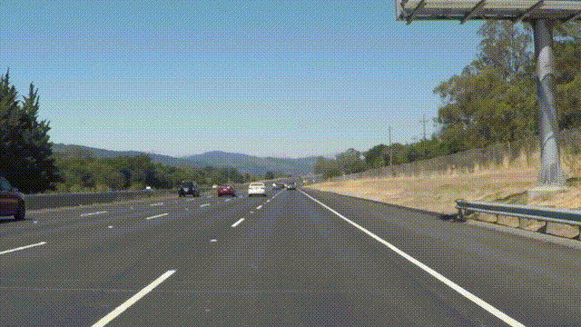
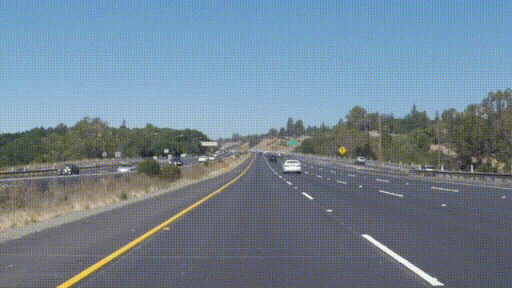
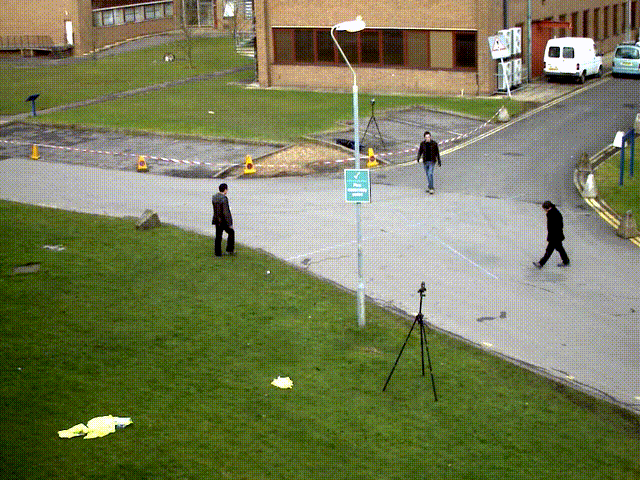
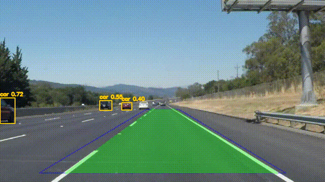
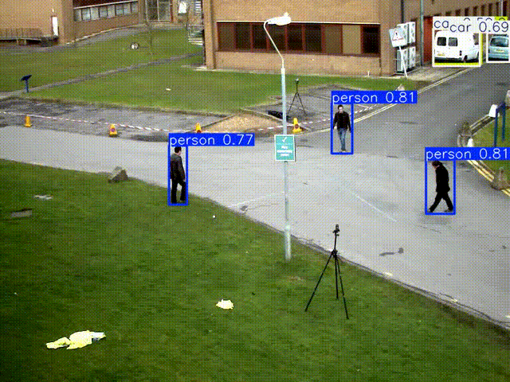

# Autonomous Driving Mini (Lane + Object Detection)

A lightweight prototype that overlays **lane detection** (OpenCV, Canny + Hough + smoothing) with **object detection** (YOLOv8 via ONNX).  
Runs on MacBook CPU or Colab GPU. Great as a learning project or research demo.

## 🚀 Features
- Lane detection pipeline with temporal smoothing
- YOLO detections exported to ONNX for CPU inference
- Fusion script overlays both lanes and objects
- Modular structure (`src/mini_drive/`, `scripts/`)
- Works with sample Udacity lane videos (`solidWhiteRight`, `solidYellowLeft`, `challenge`)

## 🛠️ Setup
```bash
python -m venv .venv
source .venv/bin/activate   # Windows: .venv\Scripts\activate
pip install -r requirements.txt
```

## 🎥 Sample Inputs & Outputs

## 🎥 Input Video Previews (10s)

| Video               | Preview                          |
|---------------------|----------------------------------|
| solidWhiteRight.mp4  |  |
| solidYellowLeft.mp4  |  |
| road_demo.mp4        |  |
| challenge.mp4        |  |

---

## 🎥 Output Previews (10s)

| Video                     | Preview                                      |
|---------------------------|-----------------------------------------------|
| solidWhiteRight_fusion.mp4 |  |
| solidYellowLeft_fusion.mp4 |  |
| road_demo_annotated.mp4    |     |
| challenge_fusion.mp4       |        |

